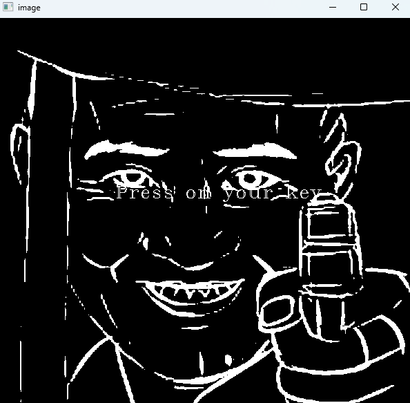
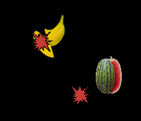

## 프로젝트 내용 요약
 - Fruit Ninja는 구글 play 게임으로 과일을 터치로 드래그하여 썰어서 점수를 얻는 방식의 게임이다.
 - 이와 비슷한 게임을 OpenCV 방식으로 손대신 마우스 클릭으로 클릭 시, 점수를 얻게 하는 방식으로 게임을 구현하고자 한다.

## 폴더 구조

```text
FruitShoot/
├─ OpenCVProject/
│  └─ OpenCVTest
│     ├─ images/  
│     ├─ FruitProcess.h
│     ├─ FruitProcess.cpp
│     └─ FruitShoot.cpp
└─ README.md
```

## 게임 설명

### 1. 게임 시작


아무 키나 입력을 하면 게임이 실행된다.

### 2. 게임 규칙
```rule
1. 총 기회는 3번으로 과일을 못 맞추거나 라인 끝까지 과일 맞추지 않으면 기회가 하나씩 차감
2. 돌아다니는 과일을 맞추면 30점을 얻고 과일을 못 맞출시 -30점을 받는다.
3. Level 구성은 총 2단계로 Lv1에서 300점이 되면 Lv2로 바뀌어 과일의 속도가 빨라진다.
4. 600점이 되면 사용자가 이기게 되는 UI와 그 전에 끝나면 지게 되는 UI를 구성
```

| Level 1 | Level 2 |
| --- | --- |
|  |  |

### 3. 클릭 이펙트 및 Cut 이미지



### 4. 게임 종료

| Win | Lose |
| --- | --- |
|  |  |
